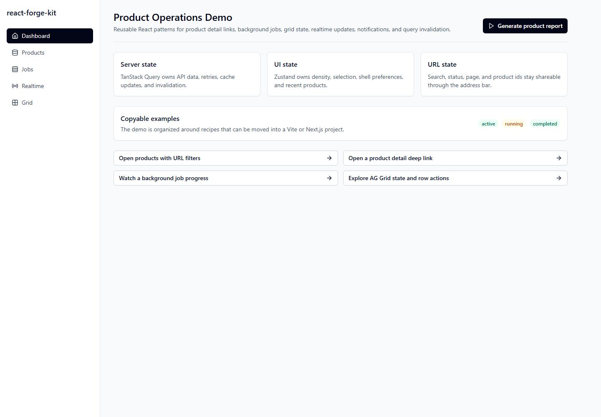
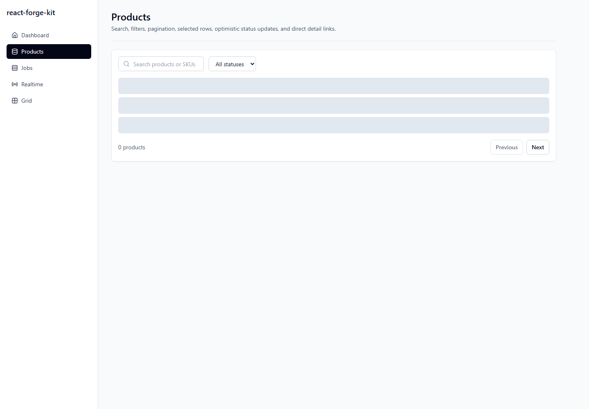
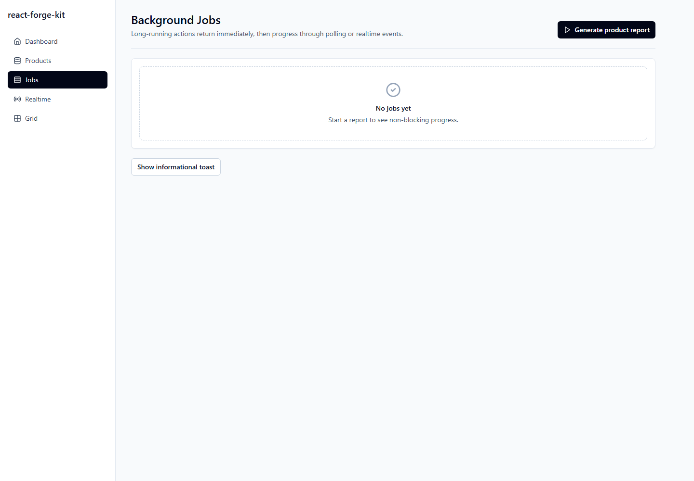
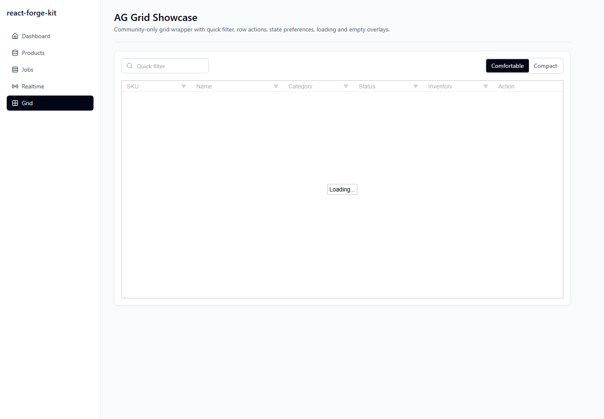

# react-forge-kit

I keep this repository as my example-driven React toolkit: small, public-safe patterns I can copy into future Vite, Next.js, and package-first React projects.

The goal is not to be another starter template. The goal is to show working patterns for product detail deep links, background jobs, progress updates, toast notifications, AG Grid state, query invalidation, local UI preferences, and clean API boundaries.

## Stack

- React, TypeScript, Vite, Tailwind CSS
- TanStack Query for server state
- Zustand for local UI state
- TanStack Router for the Vite demo
- AG Grid Community for rich grids
- SignalR client abstraction with a mock fallback
- Sonner notifications
- Vitest, React Testing Library, Playwright, ESLint, Prettier

## Quick Start

```sh
corepack enable
pnpm install
pnpm dev
```

Useful scripts:

```sh
pnpm typecheck
pnpm lint
pnpm test
pnpm build
pnpm test:e2e
```

## Cloudflare Pages

The Vite demo can be deployed to Cloudflare Pages:

```sh
corepack pnpm deploy:cloudflare
```

GitHub Actions deployment is configured in `.github/workflows/cloudflare-pages.yml`. The Pages project name is `react-forge-kit`, the production branch is `main`, and the published output is `apps/demo-vite/dist`.

See [Cloudflare Pages deployment](docs/cloudflare-pages.md).

## Scaffolder CLI

The CLI copies focused recipes into a target folder:

```sh
pnpm scaffold vite-app ./scratch/vite-app
pnpm scaffold next-app ./scratch/next-app
pnpm scaffold ui-package ./scratch/ui-package
pnpm scaffold ag-grid-page ./scratch/ag-grid-page
pnpm scaffold signalr-client ./scratch/signalr-client
pnpm scaffold tanstack-query-api-layer ./scratch/query-layer
```

The available generators are:

- `vite-app`
- `next-app`
- `ui-package`
- `ag-grid-page`
- `signalr-client`
- `tanstack-query-api-layer`

## Repository Layout

```text
apps/demo-vite          Runnable product operations demo
packages/api           Typed mock API and error normalization
packages/query         Query keys, hooks, mutations, invalidation, polling
packages/state         Zustand stores for local UI state
packages/signalr       SignalR provider, hooks, real and mock connections
packages/ui            Generic Tailwind UI primitives
packages/grid          AG Grid Community wrapper and helpers
packages/notifications Sonner notification helpers
packages/utils         URL state and formatting helpers
docs                   Architecture notes, recipes, and decision records
```

## Example Features

- Product list with search, status filter, pagination, URL state, selection, and optimistic status updates
- Product detail page that loads directly from `/products/$productId`
- Background job flow for generating a product report
- Jobs page with polling-driven progress
- Mock SignalR event bus for local realtime examples
- AG Grid page with quick filter, row actions, density preference, loading state, and empty state

## Screenshots









## State Ownership

| State type | Owner | Examples |
| --- | --- | --- |
| Server state | TanStack Query | Products, jobs, mutation results, invalidation |
| Local UI state | Zustand | Sidebar, selected rows, density, recently viewed ids |
| URL state | Router/search params | Search, filters, page number, product id |
| Ephemeral state | Component state | Open menus, draft input, temporary UI toggles |

I avoid Redux unless an example genuinely needs event-sourced client workflows. For this repo, TanStack Query, Zustand, and URL state cover the useful cases with less ceremony.

## Copy Recipes

- [Add a query hook](docs/query-patterns.md)
- [Add a mutation with optimistic update](docs/query-patterns.md)
- [Add a background job](docs/background-actions.md)
- [Add a SignalR event](docs/signalr-patterns.md)
- [Add an AG Grid action column](docs/ag-grid-patterns.md)
- [Add a deep-linked detail page](docs/url-state-and-deep-links.md)

## Public Safety

All examples are fictional, mock-backed, and product-agnostic. The repo does not use private endpoints, real customer data, real company examples, or copied application code.

## Roadmap

- Add generated screenshots for the demo app
- Expand the scaffolder with optional package selection
- Add more form recipes with React Hook Form and Zod
- Add a compact Next.js example once the Vite patterns are stable
